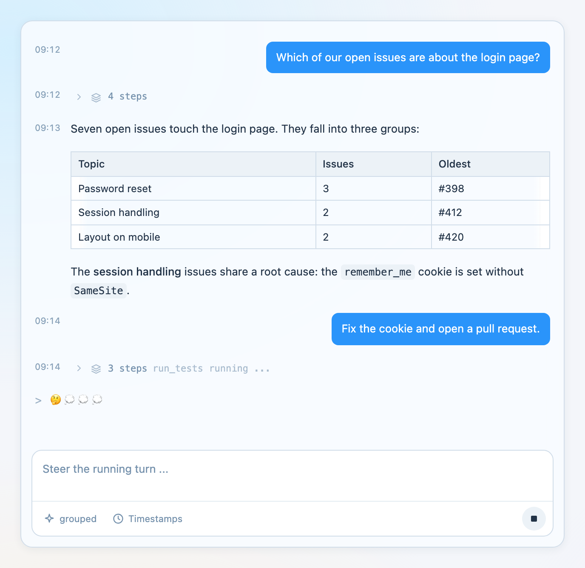
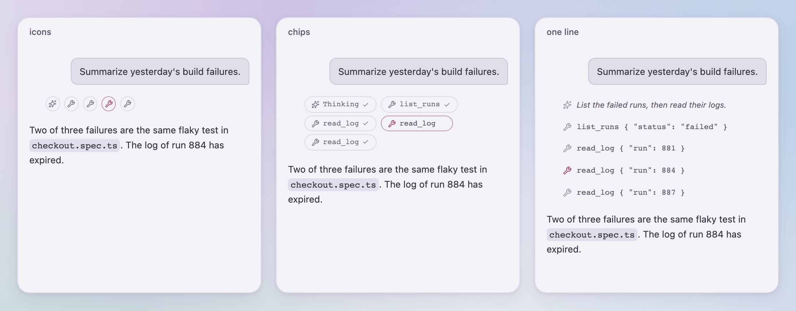
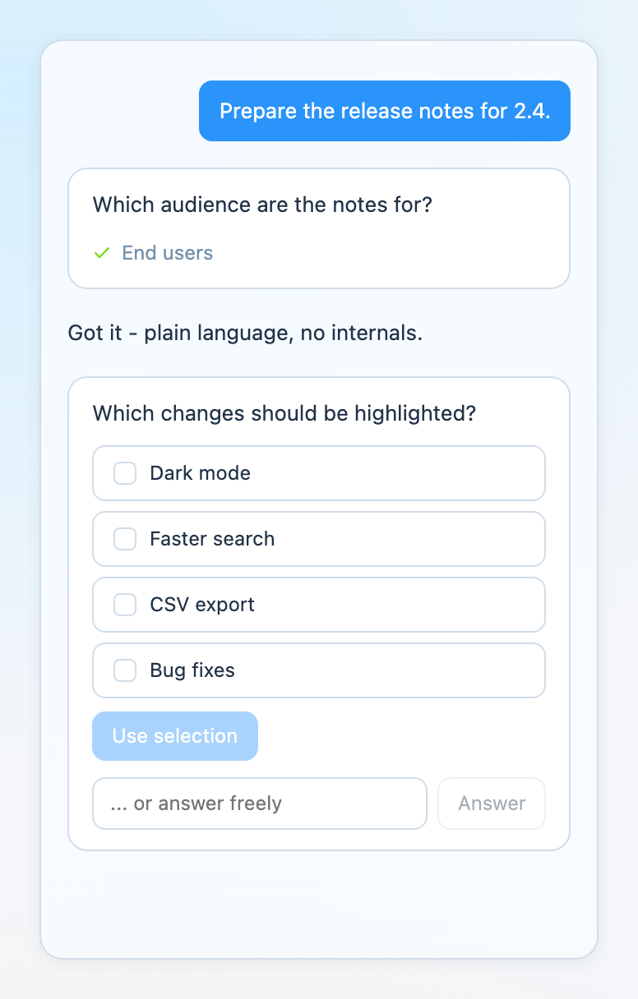
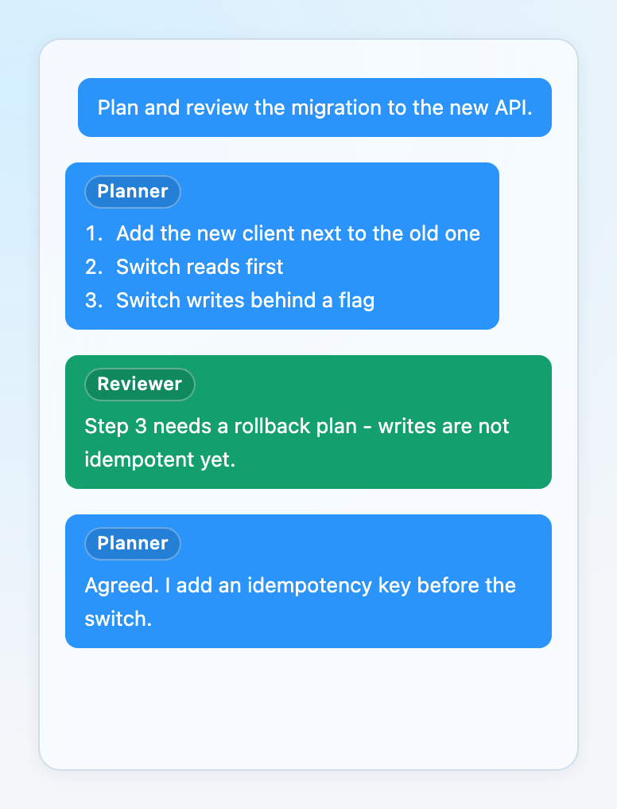
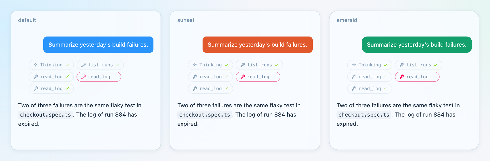
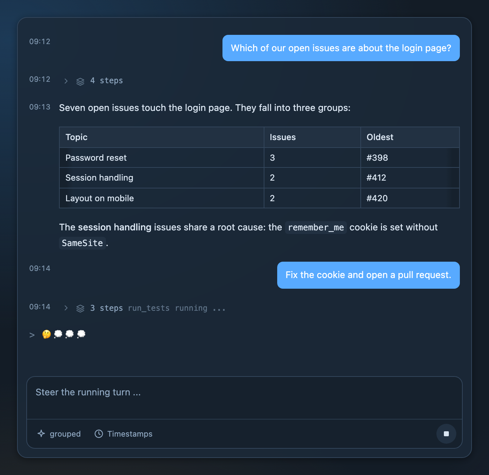

# quassel

Chat building blocks for React: a streaming transcript with thinking and tool steps, pending
actions, an input card with attachments and steering, and a small event contract that works
on the server as well. quassel is the chat of [RAgents](https://github.com/SchlenkR/RAgents),
published as a library. It ships a compiled stylesheet, so hosts need no Tailwind, and every
color, radius, font and font size is a `--qsl-*` variable.



## What you can build

**Agent chats that show their work.** Thinking and tool calls appear as steps. Pick how much
of them the user sees - only the current step, icons, chips, a collapsible group, single lines
or everything - and let them switch at runtime.



**Pending actions.** The agent waits for input: a generic card with dismiss, or the host's own
rendering per action owner. Resolved actions stay in the transcript as a record.

**Multi-party conversations.** Colored bubbles with labels for agents that talk to each other.

<p>
  
  
</p>

**Your look, not a fork.** Override `--qsl-*` variables on any wrapper, switch light and dark
with `data-theme`, or hand quassel your own Button, Toggle, Card and Popover components. With
`portalContainer` on `QuasselProvider`, popovers render inside your wrapper and pick up its
variables too.





## Highlights

- Streaming-safe Markdown (tables, code with copy button, lists) via Streamdown.
- Steering: typing while a turn runs sends into it; stop, retry and failed-send recovery built in.
- Attachments by button, drag and drop or paste, with previews and size limits.
- Timestamps, day separators, message actions, configurable bubbles and appearance.
- Screen reader friendly: the transcript is not a live region; finished replies and new
  actions are announced once, with the host in control of the wording.
- All labels are replaceable through `texts` (defaults are German).

## Install

```sh
npm install quassel
```

| Import | Contents |
|---|---|
| `quassel` | React components, `QuasselProvider`, types, texts, `announce`, `markdownPlainText` |
| `quassel/events` | The event contract, the pure reducer `applyEvent` and the attachment limits, without React |
| `quassel/chat.css` | The compiled stylesheet: theme variables, scoped reset and all utilities quassel uses |

```tsx
import { useReducer, useState } from "react";
import { applyEvent, ChatInputToolbar, ChatMessages, ChatPanel, type Message } from "quassel";
import "quassel/chat.css";

export function Chat({ send, stop }: { send: (text: string) => Promise<void>; stop: () => void }) {
  const [messages, dispatch] = useReducer(applyEvent, [] as Message[]);
  const [running, setRunning] = useState(false);
  // feed your backend's ChatEvent stream into dispatch(event) and setRunning(event.running) on "status"
  return (
    <ChatPanel composer={<ChatInputToolbar onSend={send} onStop={stop} running={running} rows={1} />}>
      <ChatMessages messages={messages} running={running} detailMode="grouped" />
    </ChatPanel>
  );
}
```

```css
.my-chat {
    --qsl-primary: #11855c;
    --qsl-radius: 0.9rem;
}
```

Any backend that emits the `quassel/events` stream works with the same components.

## Development

```sh
pnpm install
pnpm dev              # stylesheet in watch mode plus the gallery on http://localhost:3210
pnpm check            # type check package and gallery
pnpm build            # stylesheet and gallery build
pnpm release --dry-run
```

The full guide - every prop, the event contract, theming, slots, dark mode and publishing -
is in [docs/guide.md](docs/guide.md) (German). It is written so that an AI assistant can build
an application with quassel from it.

## License

[MIT](LICENSE)
