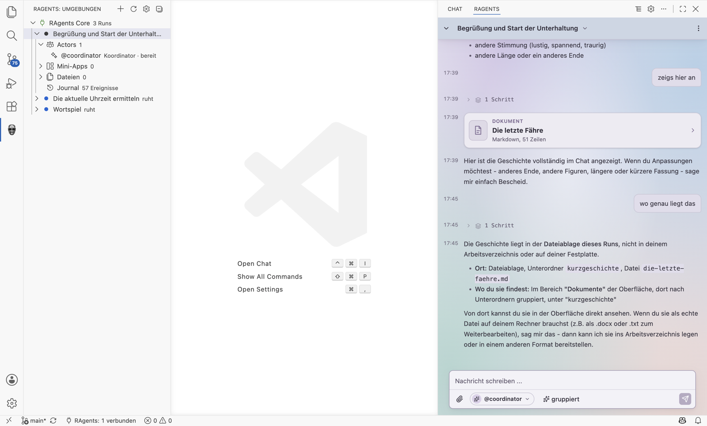
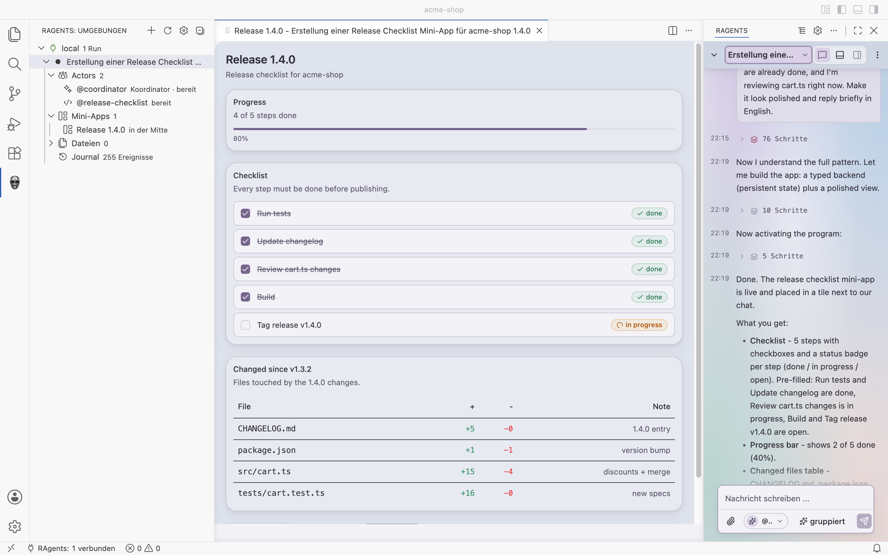

# quassel

Composable chat building blocks for React: a streaming transcript with thinking and tool steps,
clarifying questions, input components, a small CSS foundation, and a shared event contract with
two ready-made backends.

quassel is the chat UI of [RAgents for VS Code](https://github.com/SchlenkR/RAgents):





## Packages

| Package | What it is |
|---|---|
| `@quassel/events` | The event contract (`ChatEvent`) and the pure reducer `applyEvent` |
| `@quassel/chat-react` | `ChatMessages`, `ChatPanel`, `ChatInputPlain`, `ChatInputToolbar`, `useChat` and friends |
| `@quassel/foundation` | Design tokens, color wash and glass panel as plain CSS |
| `@quassel/question-element` | The question card as a framework-free web component (`<qsl-question>`) |
| `@quassel/agent-node` | Plain LLM chat backend for any OpenAI-compatible endpoint, no dependencies |
| `@quassel/agent-pi` | Backend for the Pi coding agent |
| `gallery` | Every composition once, runnable - the reference |

## Highlights

- Streaming-safe Markdown without dependencies and without `dangerouslySetInnerHTML`.
- Six detail levels for thinking and tool steps, from answers only to fully expanded.
- Steering: typing while a run is active sends into the running turn.
- Clarifying questions with single choice, multiple choice and free text.
- Optional timestamps, day separators, message actions and copy buttons for code.
- Screen reader friendly: the transcript is not a live region; finished replies and new questions
  are announced once.
- Styling through `--qsl-*` tokens instead of forked components.

## Getting started

```sh
pnpm install
pnpm dev        # gallery on http://localhost:3210
```

The packages are source packages (TypeScript and CSS, no build step). Reference them from a
pnpm workspace with `workspace:*` or from another local project with `link:`.

```tsx
import { ChatInputToolbar, ChatMessages, ChatPanel, useChat } from "@quassel/chat-react";
import "@quassel/chat-react/chat.css";

export function Chat() {
  const { messages, running, send, stop } = useChat("http://localhost:3300");
  return (
    <ChatPanel composer={<ChatInputToolbar onSend={send} onStop={stop} running={running} />}>
      <ChatMessages messages={messages} running={running} detailMode="grouped" />
    </ChatPanel>
  );
}
```

Default labels are German; replace them with the `texts` prop.

## Documentation

The full build guide, including every prop, the event contract and both backends, is in
[docs/guide.md](docs/guide.md) (German). It is written so that an AI assistant can build an
application with quassel from it.

## License

[MIT](LICENSE)
